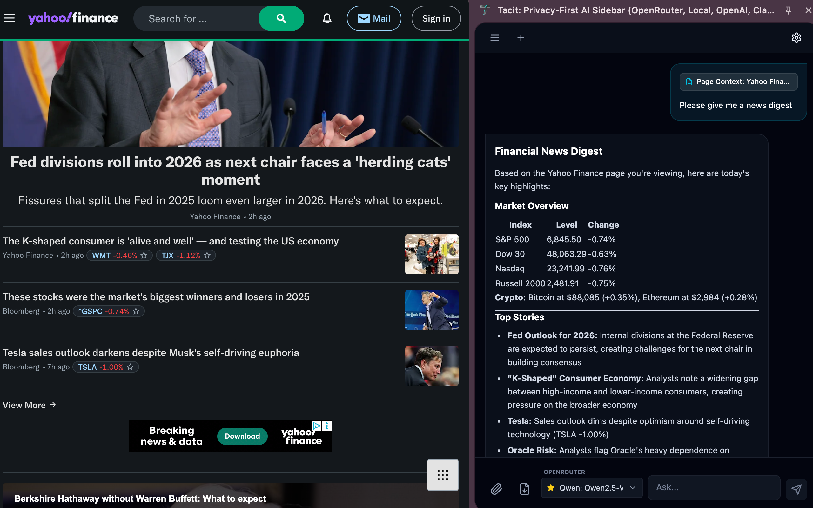
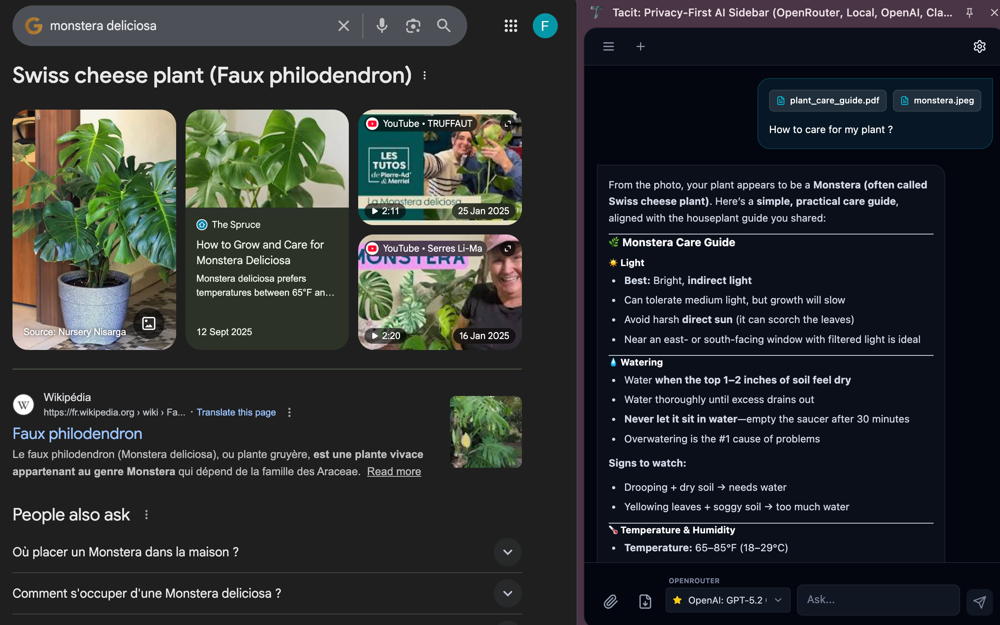
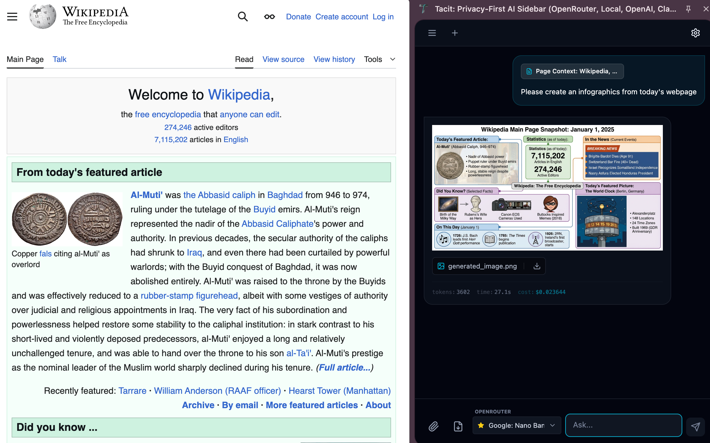
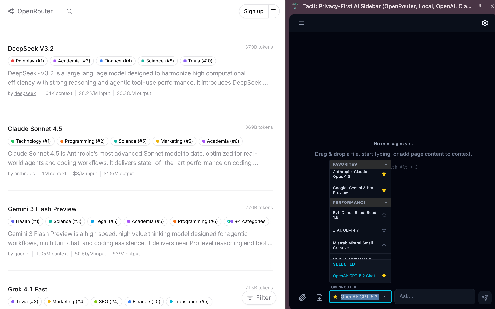

# Tacit: The Zero-Knowledge AI Sidebar

<div align="center">

[Chrome Web Store](https://chromewebstore.google.com/detail/tacit/ofkdnnmehcilcnogidbafddkdnojehea) | [Demo Video](https://www.youtube.com/watch?v=6cdTzj2b2KE)

</div>

<br />

<div align="center">
  
  
  <br/>
  
  
</div>

<br />

## 📜 Core Philosophy

**"The extension that knows nothing about you."**

Most AI browser extensions follow the same playbook:
1. Collect your data (to "improve the experience")
2. Mark up AI provider costs
3. Clutter your browser with features you didn't ask for

We built Tacit differently.

### Our Principles

### Zero-Knowledge Privacy
- **No backend servers**. We don't have a database. We literally *cannot* see your conversations.
- **Local-first storage**. Your chat history and API key are encrypted in your browser local storage.
- **Auditable code**. Open sourced on github.

### Zero-Markup Pricing
- **Bring Your Own Key (BYOK)**. Pay wholesale rates directly to OpenRouter, OpenAI, Anthropic, or Google.
- **Or pay nothing**. Run Ollama or LM Studio locally with zero API costs.
- **No subscription trap**. We'll never gate core features behind a paywall.

### Zero Clutter
- **No injected buttons** polluting your navigation.
- **No "AI Shopping Assistant"** or other gimmicks.
- **Just a sidebar**. Press `Alt+J`, ask your question, get your answer.

## ✨ Features

### ⚡ The Basics
- **Global hotkey**: `Alt+J` (or `Option+J` on Mac) slides the sidebar in from any webpage
- **Persistent chat history**: Local storage with client-side encryption
- **Works everywhere**: Lives besides your tabs, follows your browsing

### 🧠 Model Support
Connect to any of these:
- **Cloud APIs**: OpenRouter (600+ models, including vision models and Nano Banana Pro), Anthropic Claude, OpenAI GPT, Google Gemini
- **Local models**: Ollama and LM Studio with automatic CORS configuration
- **Smart defaults**: Tacit detects vision-capable models automatically

### 👀 What You Can Feed It
Feed it whatever you're working with:
- **"Read This Page"**: One-click to capture the current tab's text content
- **Drag-and-drop files**: 
  - Images → Vision analysis (screenshots, diagrams, memes)
  - PDFs → Full text extraction
  - Code/Markdown → Syntax-aware parsing

### 🌐 Web Search
Need answers about what happened yesterday? Enable web search.
- **Live Web Access**: Enable search to let the AI browse the internet for real-time info.
- **Stay Current**: Get answers about recent events beyond the model's training data.

## ⚖️ How We Compare

| | **Tacit** | Typical AI Extensions |
|:---|:---|:---|
| **Your data** | Stays on your device | Sent to their servers |
| **Cost** | No subscription. Pay for what you use or nothing (Ollama/LMStudio). | $10–$30/month (marked up subscription) |
| **UI pollution** | Clean, minimalistic sidebar | Random UI elements |
| **Model choice** | Local models, 600+ cloud | Limited model choice |

## 🚀 Getting Started

### 📦 Install from Chrome Web Store

**[Chrome Web Store](https://chromewebstore.google.com/detail/tacit/ofkdnnmehcilcnogidbafddkdnojehea) | [Manual Installation](#developer-installation)**

### 💻 Developer Installation

If you prefer to build from source or contribute:

**Prerequisites**
- Node.js (v18+)
- npm or pnpm

**Steps**

1. Clone the repository
   ```bash
   git clone https://github.com/flecomet/tacit-sidebar.git
   cd tacit-sidebar
   ```

2. Install dependencies
   ```bash
   npm install
   ```

3. Build for production
   ```bash
   npm run build
   ```

4. Load into Chrome/Brave/Edge
   - Navigate to `chrome://extensions`
   - Toggle **Developer mode** (top right)
   - Click **Load unpacked**
   - Select the `dist` folder generated in the previous step.

## 🛠️ Configuration

Tacit works out of the box once you add an API key:

1. Open the extension (Alt+J).
2. Go to **Settings**.
3. **For Cloud Models**: Enter your OpenRouter Key or a custom OpenAI-compatible endpoint URL.
4. **For Local Models**: Ensure your local server is running (usually `http://localhost:11434` for Ollama or `http://localhost:1234` for LMStudio).

## 🏗️ Technical Architecture

Tacit is a "zero-server" application running entirely in the browser:

- **Frontend**: React + Vite
- **Styling**: TailwindCSS in Shadow DOM (no CSS leakage to host pages)
- **State**: Zustand with local persistence
- **Security**: 
  - PBKDF2 + AES-GCM for API key encryption
  - Strict CSP (Content Security Policy)
  - No `eval()`, no remote code execution

## 💰 Monetization

Tacit is free and open-source (AGPL-3.0). We're not adding subscriptions, ads, or selling data.

## 🤝 Contributing

Got an idea? Open an issue first so we can discuss it before you spend time coding.

## 📄 License

AGPL-3.0 © François Lecomte-Denis
